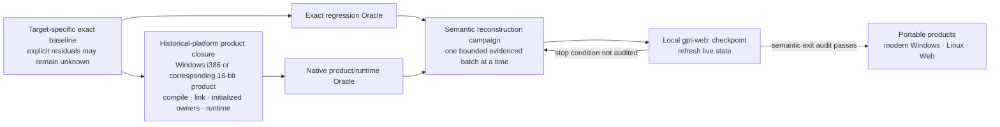

# Touhou Reconstruction Factory

This repository is the control plane for evidence-first Touhou reconstruction
projects. It defines a language-neutral truth kernel, composes compatible
platform and toolchain providers, imports existing repositories without
modifying them, and preserves historical oracle failures as regression
contracts.

The factory is not a source monorepo and is not a directory copier. A project
specification selects a coherent family of providers and produces a
`ReconstructionKit` whose claims, oracle results, artifacts, gates, and
workflows share one vocabulary.

The architecture and repository archaeology are recorded in
[`docs/factory-analysis.md`](docs/factory-analysis.md). The normative vocabulary
is in [`docs/ontology.md`](docs/ontology.md).

## System and reconstruction flow

```mermaid
flowchart LR
    H["Human<br/>scope · stop condition · release"]:::human --> I["Installed Factory Plugin<br/>five bundled skills<br/>registered ChatGPT app binding"]:::control
    K[("Factory repository memory<br/>ontology · providers · adapters<br/>fixtures · knowledge · prompt · skills")]:::memory --> I
    I --> W["GPT-web agent<br/>autonomous reconstruction<br/>bounded objective · resumable Git history"]:::agent
    W --> D["One shared Factory MCP<br/>registered repo selection<br/>atomic evidence tools + composable Bash"]:::control
    K --> D
    D --> C["Selected live game repository<br/>dirty + untracked + ignored state<br/>ledgers · original target identity"]:::repo
    C --> E["Target-attested analysis<br/>shared IDA/Ghidra executable<br/>game + target + project bound"]:::evidence
    E --> S["Autonomous source work<br/>natural C/C++ · Bash · Wine<br/>compiler · objdiff · repo scripts"]:::work
    C --> S
    F[("Shared immutable tools<br/>Ghidra · JDK · objdiff<br/>compiler packages · system Wine")]:::memory --> S
    S --> G["Game-local state<br/>Wine prefix · analysis project<br/>build outputs · knowledge input"]:::repo
    G --> L["Local gpt-web: Git checkpoints<br/>review · resume · bisect · rollback<br/>commit is not exactness proof"]:::human
    L --> J1["Exact replay<br/>function / owned extent<br/>claimed-byte coverage"]:::oracle
    L --> J2["Product closure replay<br/>complete production graph<br/>cold compile + clean link"]:::oracle
    L -.-> J3["Runtime storage / scenario<br/>separate target-bound contract<br/>live provider not implemented"]:::platform
    J1 --> A{"Integrity + freshness<br/>+ live policy<br/>accepted?"}:::gate
    J2 --> A
    J3 -.-> X
    A -->|"Rejected / invalid / stale"| X["Preserve diagnostics<br/>artifacts + explicit unknowns<br/>define the next bounded task"]:::reject
    A ==>|"Accepted"| T["Truth Kernel<br/>current accepted facts<br/>and accepted snapshots"]:::done
    T --> Q["GPT-web query / next task<br/>report receipt scope<br/>never inflate completeness"]:::agent
    X --> Q
    L -.-> P["Later local Codex retrospective<br/>completed history · scripts · tests · receipts<br/>cross-game publication not automated"]:::memory
    P -.-> K

    P98["PC-98 era family<br/>TH01–TH05<br/>currently validated: TH04"]:::platform --> C
    PE["Windows PE era family<br/>TH06+<br/>currently validated: TH08 / TH095 / TH105"]:::platform --> C

    B["Registered atomic<br/>IDA / Ghidra bridge"]:::evidence -->|"independent target attestation"| E
    S -.-> O["Optional disposable workspace<br/>explicitly isolated experiment<br/>committed source only"]:::platform

    classDef human fill:#fff1c2,stroke:#b7791f,color:#3b2f0b,stroke-width:2px;
    classDef agent fill:#ede9fe,stroke:#7c3aed,color:#2e1065,stroke-width:2px;
    classDef memory fill:#dbeafe,stroke:#2563eb,color:#172554,stroke-width:2px;
    classDef control fill:#e0e7ff,stroke:#4338ca,color:#1e1b4b,stroke-width:2px;
    classDef evidence fill:#cffafe,stroke:#0891b2,color:#083344,stroke-width:2px;
    classDef work fill:#fef3c7,stroke:#d97706,color:#451a03,stroke-width:2px;
    classDef oracle fill:#dcfce7,stroke:#16a34a,color:#052e16,stroke-width:2px;
    classDef gate fill:#f3f4f6,stroke:#4b5563,color:#111827,stroke-width:2px;
    classDef reject fill:#fee2e2,stroke:#dc2626,color:#450a0a,stroke-width:2px;
    classDef done fill:#ccfbf1,stroke:#0f766e,color:#042f2e,stroke-width:2px;
    classDef platform fill:#f5f3ff,stroke:#6d28d9,color:#2e1065,stroke-width:2px;
    classDef repo fill:#f8fafc,stroke:#475569,color:#0f172a,stroke-width:2px;
```



The main row is the normal reader journey from scope to accepted truth. Solid
arrows are operational or data-flow edges, dashed arrows mark optional or later
work, and the thick **Accepted** edge is the only route into truth. There is
intentionally no direct edge from an imported claim, analysis result, Bash/build
result, or Git commit to the Truth Kernel. Exactness, production closure, runtime
storage identity, and runtime scenarios are independent planes; their feedback
loops interact, but their truth status never transfers implicitly. See
[`independent verification planes`](docs/verification-planes.md).

The same control-plane architecture serves both eras. PC-98 and Windows PE use
different platform/toolchain providers, adapters, target identities, and replay
drivers; they converge only on the shared ontology, receipt envelope,
acceptance policy, durable workflow, and GPT-web interface.

The historical-platform development order is intentionally stricter than the
generic verification graph:



The two independent semantic feedback lanes are the key false-positive defense:
exact comparison catches target-code regressions, while the reconstructed
historical-platform product catches compile/link, initialized-data ownership,
lifetime, and exercised behavior errors. A modern port cannot replace the
native product prerequisite. This TH095-shaped sequence and the TH08 bitter
lesson are specified in the
[`semantic reconstruction workflow`](docs/semantic-reconstruction.md).

## Development

The core has no runtime dependencies outside Python 3.11 or newer. The GPT-web
service uses the optional, version-bounded MCP v2 dependency.

```bash
PYTHONPATH=src python3 -m unittest discover -s tests -v
PYTHONPATH=src python3 -m reconstruction_factory --help
PYTHONPATH=src python3 -m reconstruction_factory inspect /path/to/repo --summary
PYTHONPATH=src python3 -m reconstruction_factory fixtures
PYTHONPATH=src python3 -m reconstruction_factory knowledge
PYTHONPATH=src python3 -m reconstruction_factory validate-game-knowledge --help
PYTHONPATH=src python3 -m reconstruction_factory verify-provenance --help
PYTHONPATH=src python3 -m reconstruction_factory replay --help
PYTHONPATH=src python3 -m reconstruction_factory verify-receipt --help
PYTHONPATH=src python3 -m reconstruction_factory acceptance-registry --help
PYTHONPATH=src python3 -m reconstruction_factory inspect-accepted --help
PYTHONPATH=src python3 -m reconstruction_factory accepted-knowledge --help
PYTHONPATH=src python3 -m reconstruction_factory.service_cli --help
python3 -m pip install -e '.[mcp]'
touhou-reconstruction-factory-mcp --help
```

Game repository adapters are read-only. They never run a compiler, mutate a
ledger, or infer an exact claim from a progress percentage. The separate
`replay` command may create native ignored build products under an exclusive
repository lock; it rejects any change to tracked or non-ignored source state.

The governing principle is **accuracy before completeness**. Unknown or
incomplete state is valid output. Guessed identity, extent, origin, ownership,
or exactness is not.

The existing-repository import contract and live parity procedure are described
in [`docs/adapters.md`](docs/adapters.md).

Cross-game lessons are retained as hash-pinned, executable counterexamples.
Their evidence and verdict semantics are described in
[`docs/regression-fixtures.md`](docs/regression-fixtures.md).
Verified lessons and explicit unknowns are indexed by scope in the
[`cross-game knowledge base`](docs/knowledge-base.md).
Game repositories use a separate, non-publishing
[`game-local knowledge input`](docs/game-knowledge.md) that GPT-web may update
and commit without gaining Factory publication authority.

Factory-controlled replay and content-addressed evidence are specified in
[`docs/oracle-receipts.md`](docs/oracle-receipts.md).
The first live TH04/TH08/TH095/TH105 replay matrix and its exact limitations
are recorded in [`docs/replay-validation.md`](docs/replay-validation.md).
Only receipts admitted by an explicit live policy can enter accepted snapshots
or receipt-backed knowledge queries; see the
[`acceptance registry contract`](docs/acceptance-registry.md).

Long replays can now be submitted as SQLite-backed durable jobs and executed by
a separate worker. Job completion, oracle pass, and policy acceptance remain
three different states. The typed MCP v2 surface lets GPT-web submit, reconnect,
page complete evidence, and query only accepted facts. It also provides broad
Bash and durable output in registered live repositories, including repo-local
tools and local Git checkpoints, plus capability-addressed disposable workspaces
for explicitly isolated experiments. See
[`durable replay jobs`](docs/durable-jobs.md) and the
[`GPT-web MCP service`](docs/mcp-server.md).

The governing agent design is autonomy plus composable atomic tools: the
framework improves accuracy and efficiency without restricting unforeseen
in-repository work. Git checkpoints and verification remain different
authorities; only a later accepted replay receipt can enter the Truth Kernel.
See [`agent autonomy and tool composition`](docs/agent-autonomy.md), the
[`live repository work provider`](docs/repository-work-provider.md), and the
special-purpose [`disposable workspace provider`](docs/workspace-provider.md).

IDA and Ghidra remain separate provisional authorities. The MCP analysis
gateway now makes TH09 the first fully Factory-native instance: the single
shared Factory MCP owns the `ida-pro-mcp` stdio client, binds the active IDA
database to the registered target, and exposes composable semantic reads and
IDA metadata edits without another per-game MCP service. Legacy loopback
bridges remain temporary compatibility providers for earlier games. Every
analysis result is bounded, redacted, and worth zero exactness credit. See the
[`attested analysis provider`](docs/analysis-provider.md) and the
[`new-game bootstrap`](docs/new-game-bootstrap.md).

The repository also publishes a minimal plugin that combines the remote MCP
connection with end-to-end reconstruction and semantic workflows plus separate
analysis, optional-workspace, and evidence-preserving replay skills. Reusable
short prompts and complete standalone prompts live in
[`prompts/gpt-web-reconstruction.md`](prompts/gpt-web-reconstruction.md).
The ready-to-run TH095 semantic campaign is in
[`prompts/gpt-web-semantic-reconstruction.md`](prompts/gpt-web-semantic-reconstruction.md).
The first clean Factory-native exact campaign is in
[`prompts/gpt-web-th09-exact-reconstruction.md`](prompts/gpt-web-th09-exact-reconstruction.md).
Both prompts are complete without automatic skill injection and require the
[`dirty-work recovery and analysis-artifact lifecycle`](docs/worktree-recovery-and-analysis-artifacts.md)
before new edits.
The single-user deployment
and first TH105 web test are documented in
[`GPT-web plugin and Funnel deployment`](docs/gpt-web-plugin.md).

Run the complete local release gate with the MCP-enabled service environment:

```bash
PYTHONPATH=src .venv/bin/python scripts/validate-release.py
```

The deployed endpoint has a read-only validation mode and explicit opt-in live
analysis, real Wine/toolchain, disposable-workspace, and TH105 replay checks:

```bash
PYTHONPATH=src .venv/bin/python scripts/validate-live-mcp.py
PYTHONPATH=src .venv/bin/python scripts/validate-live-mcp.py --repository-toolchains
PYTHONPATH=src .venv/bin/python scripts/validate-live-mcp.py --all
```

The toolchain option executes non-committing probes through live-repository Bash
for all four games. `--all` additionally creates and discards a temporary TH105
workspace and submits one canonical TH105 smoke replay. See
[`docs/validation.md`](docs/validation.md) for the validation contract and latest
recorded run.
