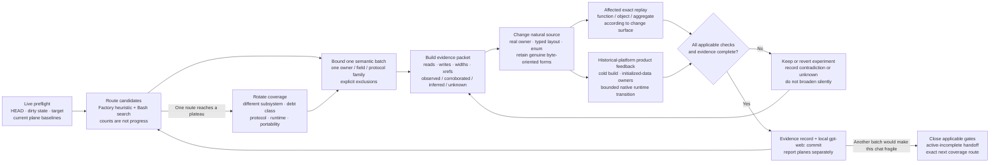

# Semantic Reconstruction Workflow

## Scope

Semantic reconstruction is the evidence-backed conversion of already recovered,
target-layout-shaped source into maintainable types, names, owners, and
protocols. It is an engineering phase shared by reconstruction repositories,
not a new path into the Truth Kernel and not a repository-wide beautification
pass.

The normative Web contract is
[`gpt-web-semantic-reconstruction-session-v4`](../contracts/gpt-web-semantic-reconstruction-session-v4.json).
It is based on the general live-repository
[`gpt-web-reconstruction-session-v5`](../contracts/gpt-web-reconstruction-session-v5.json)
contract, so autonomous Bash, target-attested analysis, local Git checkpoints,
game-local knowledge, replay receipts, and acceptance boundaries remain
unchanged.

For historical-platform reconstruction, the required order is:

```text
target-specific exact baseline
  -> corresponding historical-platform product closure and runtime-owner audit
  -> semantic reconstruction with both feedback lanes
  -> portable platform products
```

For Windows PE games the second stage is the reconstructed Windows i386
compile/link/runtime product. For PC-98 games it is the corresponding 16-bit
product and runtime environment. A known exact residual may remain honestly
`unknown`; this does not permit skipping the native product prerequisite.

## Shared vocabulary

- A **semantic-debt candidate** is a heuristic route to source that may encode
  known meaning as a raw offset, anonymous identifier, absolute view, opaque
  range, or unnamed protocol. It is not evidence that the source is wrong.
- A **semantic batch** is one coherent owner, field, representation, or
  protocol family changed and validated as a reviewable unit.
- A **semantic campaign** is the autonomous outer loop that commits successive
  bounded batches against one user objective without requesting permission
  after every successful batch.
- An **evidence record** separates observed, corroborated, inferred, and unknown
  meaning, with target addresses and limitations.
- A **regression baseline** records the live pre-edit state of every applicable
  exact, product, format, and runtime plane.
- **Affected-oracle closure** means that every check required by the actual
  change surface was rerun. It does not make the English interpretation true.
- A **semantic checkpoint** is a local `gpt-web:` commit containing a coherent
  batch and its evidence record. It is durable review state, not an Oracle
  verdict.
- A **campaign milestone** is a committed source state at which broad native
  gates and Factory receipts are closed once for that state rather than
  redundantly before another planned edit.
- An **exploration plateau** is the bounded result that one route found no
  actionable change. It forces a coverage rotation; it is not a stop or closure.
- A **conversation slice** is one adaptive bounded interval of Web work. It may
  contain one difficult batch or several tightly connected smaller batches and
  ends before browser or context reliability degrades.
- A **campaign handoff** preserves continuation state between conversations.
  Its phase state remains `active-incomplete`; it is a normal campaign
  operation, not evidence of a blocker or phase closure.
- A **semantic closure review** is a later independent Codex or human review of
  the accumulated game-local evidence. GPT-web does not perform or authorize
  this project decision.

`semantic_evidence` and `semantic_ownership` already exist as Truth Kernel claim
types. They describe bounded assertions, not a whole-project completion bit.
The current Factory has no live semantic-completion driver or acceptance
policy. Exact and product receipts created during a semantic batch may be
accepted for their own narrow claims; that acceptance does not certify a name,
type, protocol interpretation, or semantic milestone.

## Design principle: exploration cannot close an open world

An exploration agent can produce positive evidence, but it cannot certify the
absence of undiscovered work in an open world. Giving the same GPT-web campaign
both discovery authority and semantic-phase closure authority asks it to prove
a global negative from the routes it happened to inspect. A longer checklist
reduces some omissions but does not repair that authority error.

Factory therefore gives Web broad composable autonomy to inspect, edit, test,
and checkpoint, while withholding semantic closure. Every new Web conversation
defaults to `active-incomplete`. It treats earlier `ready`, `complete`,
`closure`, and `exit audit` prose as hypotheses and first tries to falsify them
with current target-local evidence outside the earlier audit's enumerated
scope. One counterexample is enough to resume work. If one bounded search finds
none, the agent changes coverage surface rather than treating the negative
result as completion or as the sole reason for an immediate handoff. Neither no
result nor no new commit changes the phase state.

Only a later, separate Codex or human review may decide that the accumulated
evidence is sufficient to close semantic reconstruction and authorize porting.
That review may use the Web history, negative searches, retained Unknowns,
Oracle results, and coverage records as inputs, but it is not an MCP receipt and
is not automatically inferred from them.

## One campaign of bounded loops



The two validation branches are coupled feedback but independent truth. A byte-
exact result does not prove an English name. A successful build or runtime path
does not prove target identity. A semantic improvement may not silently spend
an already accepted exact, build, format, or runtime baseline.

This dual-oracle prerequisite is the phase's main false-positive defense. The
target exact oracle catches code-generation, extent, relocation, and configured
byte regressions. The reconstructed historical-platform product/runtime oracle
catches compile/link gaps, initialized-data ownership, storage identity,
lifetime, and exercised behavior that function exactness cannot see. Requiring
a semantic change to preserve both substantially narrows the space of plausible
but wrong refactors. Their agreement still does not prove an English name, so
the evidence record remains mandatory.

The outer campaign loop is the throughput mechanism. A batch remains small
enough to inspect, validate, commit, revert, and bisect. The agent refreshes
live state and proceeds to another family without asking for permission when
the browser and remaining context are still reliable. A route that yields no
work causes rotation to another subsystem, debt class, protocol surface,
runtime gap, or portability boundary; that one negative result cannot be the
sole reason to hand off. Before another batch would make the conversation slow
or fragile, the agent finishes or reverts the active experiment and writes the
evidence and next route into repository state as `active-incomplete`. It never
converts the handoff into phase closure.

Campaign duration and conversation duration are deliberately independent. The
model decides the useful conversation size from current work rather than a
fixed time or batch quota. External browser automation that starts later chats
is not exposed in the prompt or semantic ontology; it is operator
orchestration, while the repository is the durable handoff boundary.

## Select the batch

Start with `factory_report_semantic_debt` when it is available. The tool scans a
repository-relative C/C++ scope in the live worktree and returns paginated
candidates in four deliberately narrow categories:

- `raw-member-access`;
- `absolute-address`;
- `anonymous-identifier`; and
- `opaque-storage`.

The report binds its result to the current HEAD and Git status digest. It also
fixes `routing_only=true`, `completion_metric=false`,
`exactness_credit="none"`, and `semantic_evidence_credit="none"`. A zero count
means only that the selected lexical profile found no matches in that scope.
The report intentionally misses numeric interpreter cases, sibling opcode
tables, resource and sound IDs, flag namespaces, lifetime errors, duplicate
owners, and domain-specific naming debt. Use broad
`factory_repository_run_shell` searches and target analysis to supplement it.

Prefer an early batch with several independent target-local reads or writes, a
small caller/owner surface, existing focused exact units, and no required
behavior change. Do not begin with a repository-wide rename, several unrelated
managers, a large interpreter rewrite, persistent-format redesign, or a name
supported only by an adjacent game.

## Recover meaning accurately

For every selected field or protocol value, inspect the target-local access
offset and width, signedness, read/write sites, bit operations, callers and
callees, strings, relocations, state transitions, lifetime, and canonical
storage owner. Record evidence as:

- **observed** when it is directly present in the canonical target,
  target-bound analysis, exact code shape, or a bounded target/runtime
  observation;
- **corroborated** when independent target-local consumers agree, or an
  adjacent game agrees with target-local evidence;
- **inferred** when the target-local role is bounded but lacks independent
  naming evidence; use a neutral name and state the limitation; or
- **unknown** when only storage, width, alignment, lifetime, extent, or a weaker
  relationship is known.

Adjacent games are workflow and corroboration sources, never substitutes for
the selected target. Decompiler labels and attractive names are hypotheses.
Focused `sizeof` and `offsetof` assertions prove only the declared layout.

Prefer real owners, fields, aggregates, enums, bitfields, and explicit protocol
types. Preserve byte addressing when it is the actual semantics of a serialized
format, instruction stream, tagged representation, or platform ABI buffer. Do
not create duplicate globals for views inside an existing aggregate, hide
unknown meaning behind a union or accessor, or mix a typed recovery with
unrelated control-flow and API redesign.

## Regression scope

| Actual change surface | Exact lane | Product, format, and runtime lane |
| --- | --- | --- |
| Private field/name/expression in one object | Run every affected exact unit. | Compile the smallest affected historical-platform surface; keep broad product closure explicitly pending until a campaign milestone unless the repository requires it immediately. |
| Shared header, class layout, inline body, PCH, or owner | Replay every affected object, then the repository-required cold aggregate exact gate. | Cold compile/link; run a bounded runtime transition when identity, lifetime, initialization, or behavior can change. |
| Serialization, protocol, persistence, callback, rendering, input, or audio | Strictly compare every touched function. | Run focused format/protocol tests, cold compile/link, and the smallest relevant runtime/output check when available. |

When the repository has no accepted unit or no deterministic runtime provider,
say `unknown` or `not applicable` with the reason. Never substitute a nearby
green check. Factory replay requires eligible committed source; repo-native
checks may still guide dirty work, but they are not accepted receipts.

Use a four-level feedback ladder:

1. During an edit, run syntax/layout checks and the smallest affected compile,
   object comparison, or target query.
2. Before a batch checkpoint, close every affected exact unit and native
   compile/link, format, or runtime surface.
3. Run aggregate exact and whole-product gates immediately for shared headers,
   layouts, PCH/inline bodies, ownership, sensitive protocols, or any focused
   failure that exposes cross-object risk.
4. At a campaign milestone and final handoff, close remaining repository-
   required aggregate exact, historical-platform product, and available runtime
   gates once for the current committed source.

Do not cold-replay the entire accepted Factory receipt set after every private
checkpoint when another planned source commit would immediately stale it. Use
repo-native Oracles for the rapid dirty-tree loop and issue current-source
receipts at meaningful committed milestones. A deferred or stale receipt plane
must be reported as non-current; batching receipt work changes cadence, not
truth.

## Record and checkpoint

An accepted game-local batch record should contain:

```text
Owner / field / protocol family and date
Scope: target addresses, functions, source files, object/profile
Observed: target-local facts
Corroborated: independent target-local and labeled adjacent-game evidence
Inference: chosen neutral names/types and confidence
Unknown: retained opaque or unresolved meaning
Layout/ABI: assertions and relationships relied on
Exact oracle: affected replay commands and results
Product/format/runtime: commands, results, or explicit unavailable state
Result: raw forms removed for this family; no project completion percentage
```

Append it to the game repository's semantic reconstruction document after the
checks pass. Update `.reconstruction/game-knowledge.json` only when a concise
fact, recipe, pitfall, decision, or unknown will materially help another game-
local session. Neither location publishes cross-game knowledge.

Create a local English `gpt-web:` commit after one coherent checked batch.
Inspect status, the full diff, and the staged diff; exclude unrelated existing
work. Do not push. Then refresh live state and begin the next batch. At a real
execution boundary, hand off the starting and ending commit/dirty state, all
completed checkpoints, selected and excluded scope, report profile and
limitations, evidence classes, layout facts, changed files, tests by feedback
level, broad gates run or explicitly deferred, every verification plane,
accepted receipts separately from semantic interpretation, retained unknowns,
and the exact next batch or coverage route. The handoff must say
`active-incomplete` and must not claim semantic closure.

## Recover before starting and bound analysis storage

Every campaign start or resume applies the
[`worktree recovery and analysis artifact lifecycle`](worktree-recovery-and-analysis-artifacts.md).
Web cannot know whether an earlier conversation disconnected, so any non-clean
state requires a full review before a new semantic batch is selected. The review
classifies partial work instead of automatically preserving it as unrelated:
recoverable work becomes the first batch, unrelated work is excluded, generated
ephemera is removed only after proof, and unknown work is neither changed nor
staged.

The same contract treats `.analysis/` as bounded non-authoritative workspace.
One-shot outputs use command-local temporary storage; longer work reuses one
manifested campaign directory. Each checkpoint measures growth, retains compact
tracked evidence, and removes only proven current-session scratch. Shared
provider state and unclassified legacy artifacts remain untouched. This avoids
both silent loss and the older pattern of accumulating a new full export,
worktree, or Wine prefix for every probe.

## Historical derivation from TH08

TH08 established the reusable workflow in commit `5592d853` and then exercised
it across typed runtime owners, protocol families, serialized storage, exact
relocations, and portable builds. Its history exposed several important
corrections that are part of this Factory contract:

- the lexical debt report is a work selector, not a completion denominator;
- one owner/field family per batch keeps evidence and regressions reviewable;
- exact VC7 bytes, portable/runtime behavior, and English meaning answer
  different questions;
- shared headers and owner changes expand replay scope beyond the edited file;
- raw serialized storage can be semantically correct and must not be typed for
  appearances;
- protocol debt remains after structural offset counts reach zero;
- value-equal globals can still be different physical objects with broken
  lifetime or callback state;
- exact source expression shape may require a narrowly scoped compatibility
  bridge, but a bridge cannot invent an owner or meaning; and
- aggregate failures must be classified before broadening a semantic batch.

TH08's later protocol passes also demonstrated that primary interpreter opcodes
can be readable while operand selectors and secondary streams remain raw. Its
eventual authored-readability milestone used much broader evidence than a local
field plateau: all four production structural-router categories reached zero;
weak identifiers and unknown API conventions were individually closed or
honestly classified; owner, lifecycle, callback, serialization, replay, audio,
UI, and persistence surfaces were audited; primary and secondary interpreter
domains received complete coverage guards; and TH06/TH07 were used as an
adversarial readability challenge rather than as target authority. Those
surfaces are reusable routing directions for future campaigns, not an automatic
completion checklist.

### Bitter lesson: do not port before native product closure

TH08 discovered this order late. A modern Linux product could compile, link,
and enter gameplay while its port-side startup temporarily populated target-
initialized data that the reconstructed VC7 Windows product did not actually
own. Running the real reconstructed i386 product exposed an empty
`g_EffectTemplates` table and the same owner class around Last Spell counts,
stage-result score data, and dialogue colors. Repairing those definitions in
their semantic translation units preserved all affected exact units while
closing the native product's actual data ownership.

The reusable lesson is not "test one more port." It is to complete and exercise
the corresponding historical-platform product before semantic reconstruction,
then preserve its native product/runtime lane alongside the target exact lane.
Portable products begin after the semantic prerequisite and become additional
consumers; they must never hide or supply missing ownership in the canonical
reconstruction.

## TH095: first Factory consumer

TH095 is the first repository intended to run this workflow from the shared
Factory rather than a game-specific semantic skill. Its historical entry point
is commit `339bb5a`, which declares semantic reconstruction as the next phase.
At the 2026-09-10 preflight, the canonical Japanese v1.02a target passed its
SHA-256/MD5 identity checks, target-attested Ghidra passed all six mapped byte
samples, and the ledgers reported 697 source-present authored functions, 696
exact functions, and 336,486 exact bytes. The production graph has 88 sources
and two profiles; its independently replayable `whole_build_closed` product
claim was established at the earlier immutable playable checkpoint.

These are entry baselines, not semantic evidence and not promises about the
next live worktree. Every Web session must rerun the current preflight. The
2026-09-10 worktree also contained four pre-existing untracked experiment files;
they must be inspected and preserved, not silently committed with a semantic
batch or deleted to make replay eligible.

For TH095, begin with:

```bash
python3 scripts/verify-target.py
python3 scripts/report-reconstruction-status.py --summary
python3 scripts/validate-tracking.py --require-target
python3 scripts/ghidra.py check
```

Use `factory_report_semantic_debt(repository_id="th095",
relative_path="src", category="all", ...)` for the first lexical routing
snapshot, then supplement it with repository search and target-attested Ghidra.
The first source batch should be a small, high-evidence owner or field family,
not the largest ECL interpreter, a persistent-format redesign, or a global
anonymous-field sweep.

TH095's native exact gate is `python3 scripts/replay-exact-units.py`; use one or
more `--source` selections for focused affected objects and the no-argument cold
run when a shared change requires the aggregate gate. Its product gate is
`python3 scripts/build-whole.py`, and target-independent maintenance closes with
`python3 scripts/ci.py` plus `git diff --check`. Run the smallest applicable
runtime or format check for behavior-sensitive batches, but keep the live
Factory runtime plane `unknown` until a deterministic target-bound runtime
provider exists.

### 2026-09-11 open-world closure correction

TH095 provided the concrete counterexample that motivated semantic campaign
v3. SEM-059 declared game-local readiness after an apparent evidence plateau
and specifically recorded compact enemy `+0x285C` as having target-high writes
but no TH095-local reader. The next Web conversation found the missed
`enter_subroutine` consumer, recovered the 32-entry ECL subroutine table in
SEM-060, and explicitly superseded that part of the earlier audit. SEM-061 then
corrected an overconfident timer name before SEM-062 issued another readiness
statement.

A bounded review of SEM-062 found that it retested seven named Enemy/ECL
families, not the whole semantic phase. At its committed HEAD the Factory router
still reports 991 routing-only findings across 197 C/C++ files—165 raw-member
and 826 anonymous-identifier candidates—and the 63 Web batches changed 33
C/C++-like source files. These counts are not completion percentages and many
findings may be legitimate exact-facing or unknown storage, but neither the
remaining findings nor the untouched structural, owner, protocol, persistence,
runtime, and portability surfaces received an exhaustive disposition in
SEM-062. Runtime storage and scenario validation also remained explicitly
unknown. The TH095 document itself continued to say `Status: active` and made no
whole-program semantic-completion claim.

Therefore SEM-062 is retained as valuable game-local evidence and a campaign
milestone, but its readiness sentence has no phase-closing authority. Every new
Web conversation defaults TH095 to `active-incomplete`, first tries to falsify
the latest closure prose, and then keeps rotating coverage and producing
evidence. A later independent Codex or human review decides closure.

### 2026-09-11 bounded-conversation correction

The first closure correction overreached operationally. Contract v3 correctly
removed Web's authority to close the open semantic world, but its repeated
instruction to continue in the same conversation coupled campaign persistence
to browser lifetime. Long-running TH09 and TH095 use showed that the Web client
can become sluggish before the repository workflow has any real blocker.

Contract v4 preserves `active-incomplete`, adversarial resume review, coverage
rotation, and independent closure authority while making each conversation
adaptive and bounded. A negative search still cannot be the sole excuse for an
immediate handoff, but after useful coherent progress the agent may checkpoint
and hand off before another batch risks client or context reliability. No fixed
batch count or time limit is imposed. The operator's mechanism for launching
the next chat remains outside the prompt; only repository-backed continuation
state is part of the reconstruction contract.
